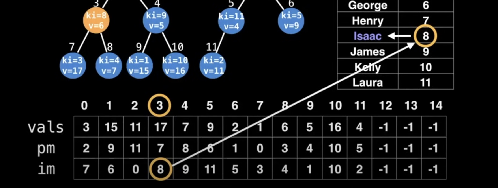

# Indexed Priority Queue
An Indexed Priority Queue is a traditional priority queue variant which on top of the regular PQ operations supports quick updates and deletions of key-value pairs.

The Indexed Priority Queue (IPQ) data structure lets us do this efficiently. The first step to using an IPQ is to assign index values to all the keys forming a bidirectional mapping.

Following is an hospital persons priority


Q: Why are we mapping keys to indexes in the domain [@, N)?
A: Typically priority queues are implemented as heaps under the hood which internally use arrays which we want to facilitate indexing into.

IPQ ADT Interface
If ‘k’ is the key we want to update
first get the key’s index: ki = map[k],
then use ‘ki’ with the IPQ

```
delete(ki)
valueOf (ki)
contains (ki)
peekMinKeyIndex()
pollMinKeyIndex()
peekMinValue()
pollMinValue()
insert(ki, value)
update(ki, value)
decreaseKey(ki, value)
increaseKey(ki, value)
```

The complexity is either logarithamic or Constat time.
```

Operation 			Indexed Binary Heap PQ
delete(ki) 				O(log(n))
valueOf (ki) 			0(1)
contains (ki) 			o(1)
peekMinKeyIndex() 		o(1)
pollMinKeyIndex() 		O(log(n))
peekMinValue() 			O(1)
pollMinValue() 			O(log(n))
insert(ki, value) 		O(log(n))
update(ki, value) 		O(log(n))
decreaseKey (ki, value) O(log(n))
increaseKey(ki, value) 	O(log(n))
```

For the binary tree representation in an arrray we can find child nodes by following. Let i be the current node.
```
Left child index: 21 + 1
Right child index: 2i + 2
```
(zero based) index assume


# Example

To figure out who to serve next use a Min IPQ to sort by lowest value first.

For Bella the ki=1 so the value can find by following


But to find the index of the node for particular key, we need to find a position map, tell us the index of node in heap.


How do find the ki for a given node? Inverse lookup help here.
im (inverse map)


Q: Which person (key) is being represented in the node at index position 3?
Find the key index through inverse map, then find actual key(8) from bi directional hash table. Then we can conclude the node at position 3 represents the key 'Issac'



# Insertion

Inserted a new value 'mary' 12; but the heap in variant is not satisfied. Because the node at index 12 has a value less than node at index 5


So we swap the newely updated value upwards until heap in variant satisfies.
For swaping nodes we need to update the position map and invese map.
The vals index is no need to touch


