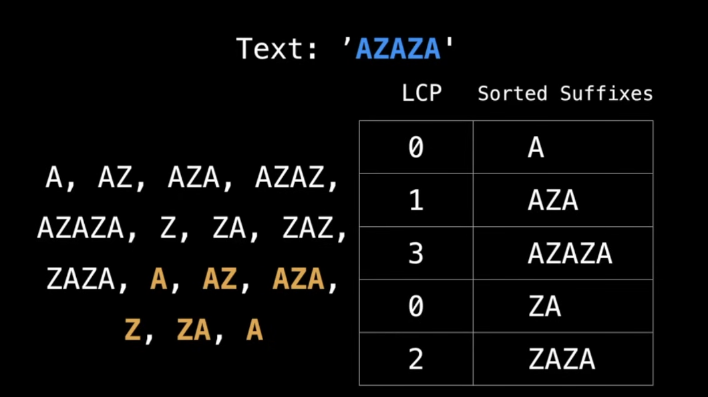
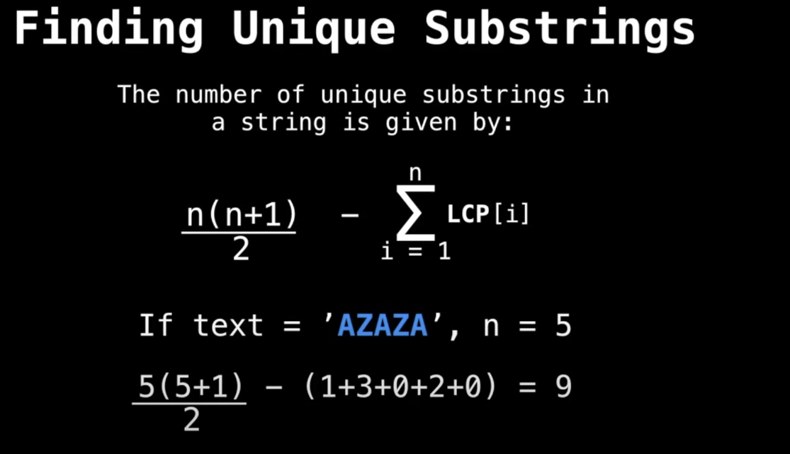
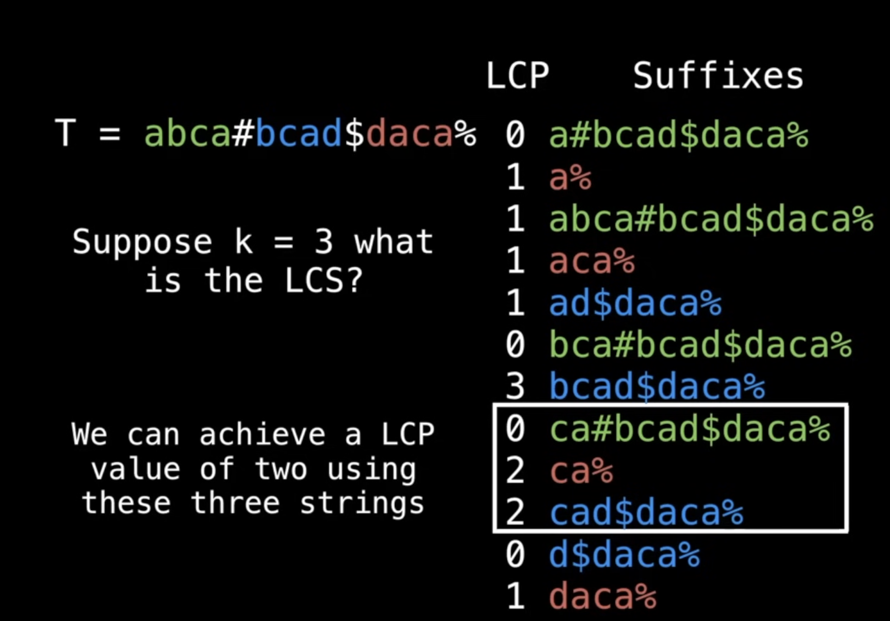
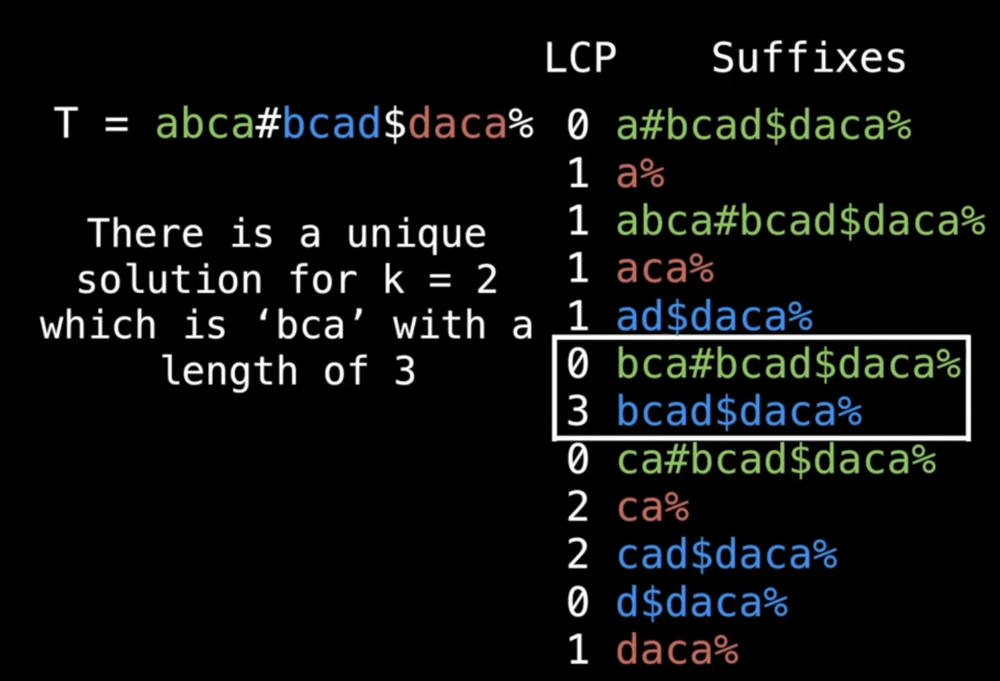
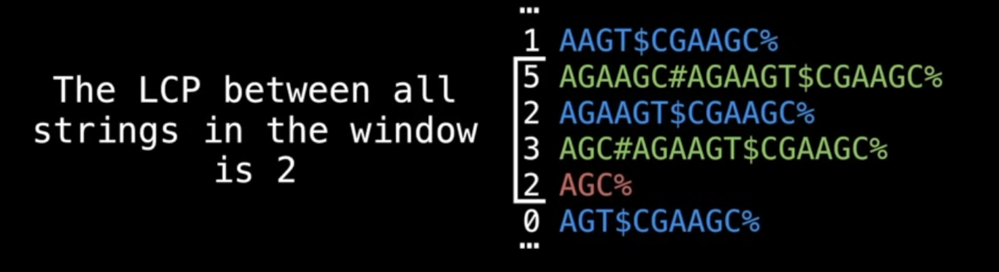
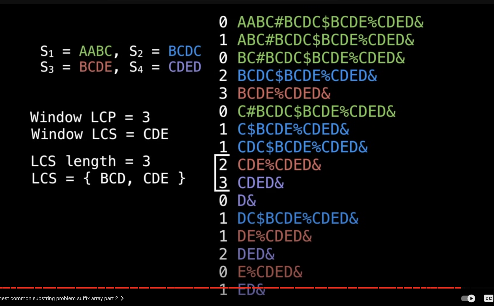

# Suffix Array
suffix array is an array which contains all the sorted suffixes of a string.
SA for cammel is

```
0 camel
1 amel
2 mel
3 el
4 l

 |
 ˅
1 amel
0 camel
3 el
4 l
2 mel
```

The actual ‘suffix array’ is the array of sorted indices. Because in INDICES WHERE suffx starts.

The suffix array provides a space efficient alternative to a suffix tree which itself is a compressed version of a trie.
NOTE: suffix arrays can do everything suffix trees can, with some additional information such as a Longest Common Prefix (LCP) array.

# Longest Common Prefix (LCP) ----------------
```
A prefix generally refers to a sequence of characters or elements that appears at the beginning of a string or a structure
```
LCP value: The LCP value at index  i is the length of the longest common prefix between the suffix at index i and the suffix at index i-1 in sorted array.

```
Sorted Index	LCP Suffix
5				0	AB
0				2	ABABBAB
2				2	ABBAB
6				0	B
4				1	BAB
1				3	BABBAB
3				1	BBAB
```

By convention, LCP[0] is undefined, but for most purposes it’s fine to set it to zero(so not interfeare).

NOTE: There exists many methods for efficiently constructing the LCP array in 0(nlog(n)) and O(n)..Linear.

### Example
In the context of a suffix array, the Longest Common Prefix (LCP) refers to the length of the longest common prefix between consecutive suffixes in the lexicographically sorted list of all suffixes of a given string.

Key concepts:
Suffix Array: A suffix array is an array of integers providing the starting positions of all suffixes of a given string, sorted in lexicographical order.

LCP Array: The LCP array is an array of integers where each entry represents the length of the longest common prefix between the current suffix and the previous one in the sorted suffix array.

Example:
Consider the string "banana":

Suffixes:
```
"banana" (index 0)
"anana" (index 1)
"nana" (index 2)
"ana" (index 3)
"na" (index 4)
"a" (index 5)
```

Suffix Array (sorted by lexicographical order):
```
"a" (index 5)
"ana" (index 3)
"anana" (index 1)
"banana" (index 0)
"na" (index 4)
"nana" (index 2)
```
LCP Array:
LCP between "a" and "ana" = 1 (common prefix: "a")
LCP between "ana" and "anana" = 3 (common prefix: "ana")
LCP between "anana" and "banana" = 0 (no common prefix)
LCP between "banana" and "na" = 0 (no common prefix)
LCP between "na" and "nana" = 2 (common prefix: "na")
Thus, the LCP Array for the string "banana" is:LCP=[0,1,3,0,0,2]
```
Each entry in the LCP array tells us the length of the longest common prefix between consecutive suffixes in the suffix array. The first entry is typically 0 because there is no previous suffix to compare.
```

# Finding Unique substring ----------------

The naive algorithm generates all substrings and places them in a set resulting in a 0(n^2) algorithm.
A better approach is to use the LCP array. This provides not only a quick but also a space efficient solution.


String "AZAZA" has n(n+1)/2 = 15 substrings
Calculating its LCP

LCP Array: The LCP array tells you how many characters each suffix shares with the previous one. By summing up the LCP values, you effectively count how many substrings overlap between consecutive suffixes.


The overlaps represent non-unique substrings, so subtracting the total of LCP values from the total substrings gives the number of unique substrings.


https://github.com/williamfiset/DEPRECATED-data-structures/tree/master/com/williamfiset/datastructures/suffixarray 


# [K common substring]/[Longest common substring] problem ------------

Suppose we have n strings, how do we find the longest common substring that appears in at least 2 <= K <= n of the strings?

Consider n=3, k=2 with:
<br />
S1 = 'a***bca***'
s2 = '***bca***d'
S3 = 'daca'

`'bca' is logest common substring:` The LCS is not be unique there can be mutliple

One approach is to use dynamic programming running in O(n<sub>i</sub> * n<sub>2</sub> * n<sub>3</sub> * .. * n<sub>m</sub>), where n<sub>i</sub> is the length of the string S<sub>i</sub>. This may be ok for a few small strings, but rapidly gets unwieldy.

An alternative method is to use a suffix array which can find the solution in O(n<sub>i</sub> + n<sub>2</sub> + n<sub>3</sub> * .. * n<sub>m</sub>) time

```
Dynamic Programming (DP) is a problem-solving technique used in computer science to efficiently solve problems 
that can be broken down into smaller, overlapping subproblems. It's often used when a brute-force approach
would be too inefficient due to the exponential growth of the number of subproblems.
```

Consider again:
S1 = abca, S2 = bcad, S3 = daca

To find the LCS first create a new larger string T which is the concatenation of all the strings Si separated by unique sentinels(this symbols ascci should be less than alphabets).
T= S1+ # +S2 + ‘$" + S3+ ‘%’ = abca#bcad$daca%

Now create suffix array in linear time
```
0 #bcad$daca%s
0 $daca%
0 %
0 a#bcad$daca%s
1 a%
1 abca#bcad$daca%
1 aca%
1 ad$daca%
0 bca#bcad$daca%
3 bcad$daca%
0 ca#bcad$daca%
2 ca%
2 cad$daca%
0 d$daca%
1 daca%
```

Remember that we need one string of each colour and the maximum LCP between them
LCS Algorithm Things can get more messy when suffixes of different colours are not exactly adjacent.

Use a sliding window to capture the correct amount of suffix colours. At each step advance the bottom endpoint or adjust the top endpoint such that the window contains exactly K suffixes of different colours.


LCS Algorithm For each valid window perform a range query on the LCP array between the bottom and top
endpoints. The LCS will be the maximum LCP value for all possible windows.


Suppose if k=2, thats The maximum prefix that can be get from any any two different coloured suffix.


The LCP between all strings in the window is 2, which is the minimum value in window.

Lucky for us, the minimum sliding range query problem can be solved in a total of O(n) time for all windows!
Alternatively, you can use min range query DS such as a segment tree to perform queries in log(n) time which may be easier but slightly slower running for a total of O(nlog(n))


Additionally, we will need a DS (hashtable) to track the colours in our sliding window.


# Longest Repeated Substring

The brute force method requires 0(n^2) time and lots of space. Using the information inside the LCP array saves you time and space.

We have 4 strings, need to find in atleast two strings(k=2)
T = AABC#BCDC$BCDE%CDED&


Look at the varables: Window LCP, Window LCS, LCS Length, LCS
During the step reduce window size from top and if not meet k expand to bottom.


Find the LRS of the string: ‘ABRACADABRA’?


